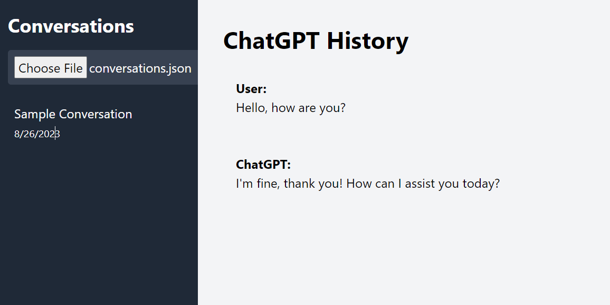

# ChatGPT History Viewer

A standalone HTML viewer for displaying ChatGPT conversation history without requiring a Python server. This application lets you view and browse through ChatGPT conversations stored in a local `conversations.json` file.



## Features
- **Load and display ChatGPT conversations** stored in a `conversations.json` file.
- **Syntax highlighting** for code blocks using `highlight.js`.
- **Copy code snippets** directly from the viewer.
- **User-friendly UI** built with Tailwind CSS.
- **Standalone operation**—works without a web server.

## How to Use
### 1. Clone the Repository:
```bash
git clone https://github.com/YOUR_USERNAME/chatgpt-history-viewer.git
cd chatgpt-history-viewer
```

### 2. Open the `index.html` file:
```bash
# Open `index.html` using your default browser:
open index.html  # MacOS
start index.html # Windows
```

### 3. Upload a `conversations.json` file:
- Use the **file upload button** on the left sidebar to select a valid ChatGPT history file.

## How to Download Your ChatGPT History
To download your ChatGPT chat history:

1. **Sign in to ChatGPT** at [chat.openai.com](https://chat.openai.com).
2. Click on your profile icon in the top right corner.
3. Click **Settings**.
4. Under **Data Controls**, select **Export Data**.
5. Confirm the export, and you will receive an email with a download link.
6. Download the `.zip` file from the link. Extract it to find the `chat.html` file.
7. **Convert `chat.html`** to `conversations.json` using the format below.

### `conversations.json` Format:
The `conversations.json` file should be structured like this:

```json
[
    {
        "title": "Sample Conversation",
        "update_time": 1693078395,
        "mapping": {
            "node_1": {
                "message": {
                    "id": "node_1",
                    "author": {
                        "role": "user"
                    },
                    "content": {
                        "parts": [
                            "Hello, how are you?"
                        ]
                    },
                    "create_time": 1693078300
                }
            },
            "node_2": {
                "message": {
                    "id": "node_2",
                    "author": {
                        "role": "assistant"
                    },
                    "content": {
                        "parts": [
                            "I'm fine, thank you! How can I assist you today?"
                        ]
                    },
                    "create_time": 1693078350
                }
            }
        }
    }
]
```

### 4. Place the file in the same directory as `index.html`:
- The viewer will automatically read and display the data when the file is uploaded using the built-in file selector.

## Contributing
Feel free to fork the repository and submit pull requests. Any improvements and suggestions are welcome!

## License
This project is licensed under the MIT License - see the [LICENSE](LICENSE) file for details.
